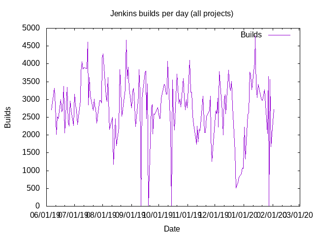
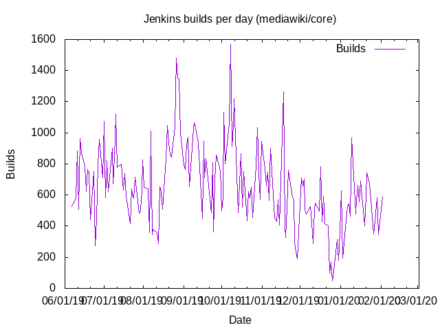
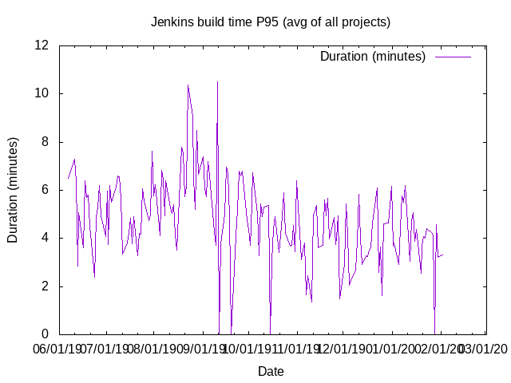
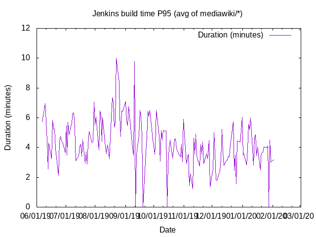

# Wikimedia Jenkins stats

This repo does some graphing and aggregation of the statistics that
[@marxarelli](https://github.com/marxarelli) has made public on his [people
page](https://people.wikimedia.org/~dduvall/jenkins/)

## Number of builds

## P95 Durations of builds (minutes)

